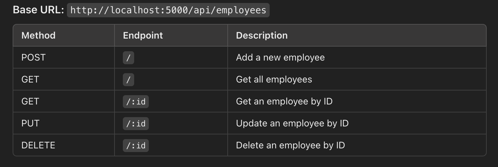

# HRM System

A simple Human Resource Management (HRM) system built with:

- **Frontend**: ReactJS (TypeScript)
- **Backend**: Node.js with ExpressJS (TypeScript)
- **Database**: MongoDB

## Features

- Add new employees
- View a list of all employees
- Search for employees by ID
- Edit employee details
- Delete employees
- Upload employee observation report in excel format
- Export employee details into excel

## Project Structure

### Backend (`backend`)

- Handles API requests and CRUD operations for employee data.
- Uses MongoDB as the database.

### Frontend (`frontend`)

- Provides a user-friendly interface for interacting with the HRM system.

---

## Getting Started

### Prerequisites

- [Node.js](https://nodejs.org/) (v14 or later)
- [MongoDB](https://www.mongodb.com/)
- [npm](https://www.npmjs.com/)

### Installation

#### 1. Clone the repository

```bash
git clone https://github.com/randyharrogates/hrm.git
cd hrm
```

#### 2. Setup the backend

```bash
cd backend
npm install
```

Create a .env file in the backend folder with the following:

```makefile
MONGO_URI=mongodb://127.0.0.1:27017/hrm
PORT=5000
```

Run the backend

```bash
npx ts-node-dev src/server.ts
```

#### 3. Setup the frontend

```bash
cd frontend
npm install
```

Run the frontend

```bash
npm start
```

### Usage

1. Open your browser and visit ```http://localhost:3000```.
2. Use the interface to add, view, edit, and search for employees.

### API endpoints



### Technologies Used

#### Backend

- Node.js
- ExpressJS
- TypeScript
- MongoDB

#### Frontend

- ReactJS
- TypeScript
- Axios
- React Router

### Required Environment Variables

```bash
MONGO_URI=mongodb://127.0.0.1:27017/hrm
PORT=5000
```

### Using docker for running

```bash
docker-compose up --build -d
